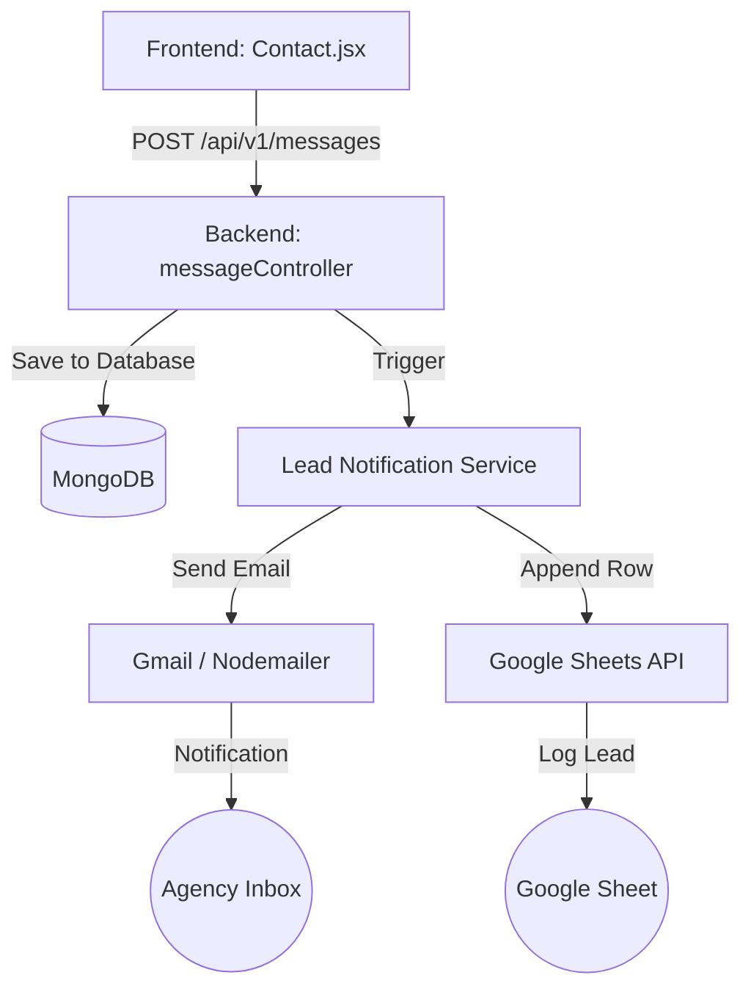

# Lead Notification & Logging Architecture

This document explains the architecture and implementation details for automatically notifying the agency via email and logging leads to Google Sheets when a user submits the contact form.

## 1. Overview

The Lead Notification System is a backend extension that intercepts incoming contact form messages and distributes them to external services (Email and Google Sheets) to ensure no lead is missed and all data is centralized.

## 2. Architecture Diagram

## 3. Dependencies

To implement this, we add two key libraries to the backend:

| Dependency | Purpose | Why? |
| :--- | :--- | :--- |
| `nodemailer` | Email Delivery | The industry standard for Node.js to send emails via SMTP. It is reliable and supports secure connections. |
| `googleapis` | Google Sheets Access | Official Google library to interact with Google Sheets. It allows us to programmatically append rows to a spreadsheet. |

## 4. Implementation Details

### A. Email Service (`emailService.js`)
- Uses SMTP transport with `itqanaiagency@gmail.com`.
- Requires an **App Password** for security (instead of your main password).
- Generates a clean, formatted HTML email containing the lead's details.

### B. Google Sheets Service (`sheetsService.js`)
- Uses a **Service Account** for authentication.
- A Service Account is a special "bot" account that can access your Google resources without requiring a manual user login every time.
- The service maps JSON keys from the environment to log in and append data to the specified `GOOGLE_SHEET_ID`.

## 5. Setup Instructions (Crucial)

### 1. Gmail "App Password"
Since you are using Gmail, standard password login is often blocked.
1. Go to your [Google Account Security](https://myaccount.google.com/security).
2. Enable **2-Step Verification**.
3. Search for **"App Passwords"**.
4. Create one for "Mail" and "Windows Computer".
5. Copy the 16-character code into `EMAIL_PASS` in your `.env`.

### 2. Google Service Account & Key
This is what fills `GOOGLE_SERVICE_ACCOUNT_EMAIL` and `GOOGLE_PRIVATE_KEY`.
1. Go to [Google Cloud Console](https://console.cloud.google.com/).
2. Create a new project (e.g., "Itqan Agency Website").
3. Enable the **Google Sheets API**.
4. Go to **APIs & Services > Credentials**.
5. Click **Create Credentials > Service Account**.
6. Give it a name and click **Create**.
7. In the Service Account list, click on the new account, go to the **Keys** tab, and click **Add Key > Create New Key (JSON)**.
8. **Download the JSON file**. Open it:
    - `client_email` goes into `GOOGLE_SERVICE_ACCOUNT_EMAIL`.
    - `private_key` goes into `GOOGLE_PRIVATE_KEY` (Keep the `\n` characters!).
9. **Final Step**: Open your Google Sheet and click **Share**. Enter the `client_email` from your JSON file and give it **Editor** permissions.

## 6. Error Handling
- The services are designed to fail silently or log errors without crashing the main API.
- If the email fails, the user still gets a "Success" message on the site, and the message is still saved in MongoDB.
