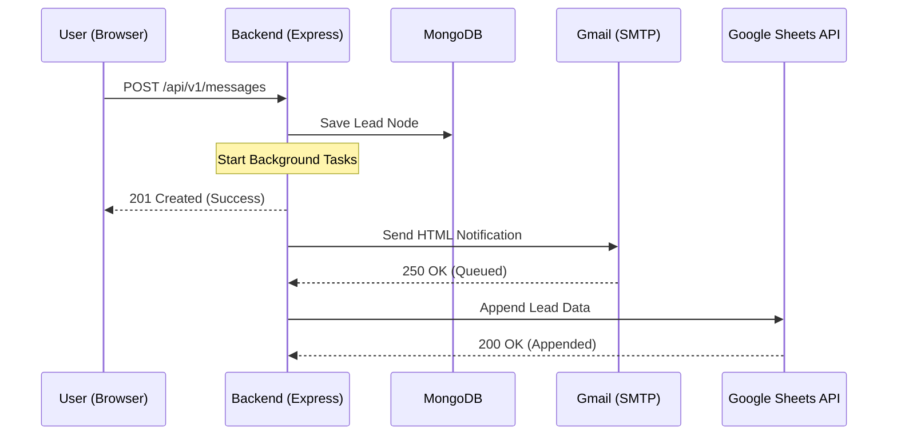

# Notifications System: Architecture

The Lead Notification System is designed to be highly modular, asynchronous, and secure. It ensures that every interaction on the website's contact form is reliably delivered to the agency's stakeholders.

## 1. System Design Pattern

We use a **Service-Based Architecture** for integrations. Instead of cluttering the main business logic (controllers), we offload "external" operations to dedicated service utilities.

### Why this design?
- **Separation of Concerns**: The `messageController` only manages the "Message" entity. It doesn't need to know *how* an email is sent or *how* a sheet is updated.
- **Maintainability**: If we want to switch from Gmail to SendGrid, or from Google Sheets to a CRM like HubSpot, we only need to update the service files.
- **Resilience**: A failure in the external email service won't prevent the lead from being saved to the database or show an error to the user.

## 2. Communication Flow

## 3. Security Architecture

### Email Security
Instead of using a primary Google password, we use **OAuth SMTP with App Passwords**. This allows us to revoke the server's access at any time without changing the main account password.

### Google Sheets Security
We use **Service Account Authentication**. 
- **No User Login**: The server authenticates itself using a private RSA key.
- **Least Privilege**: The service account can only access sheets that have been explicitly "Shared" with its email address.
- **Environment Isolation**: Private keys are stored in encrypted environment variables, never hardcoded in the repository.

## 4. Scalability
The system currently processes notifications directly in the background. For higher traffic, this could be extended into a **Message Queue (Redis/RabbitMQ)**, but for current agency needs, this lightweight approach is optimal and ensures zero delay for the user.
